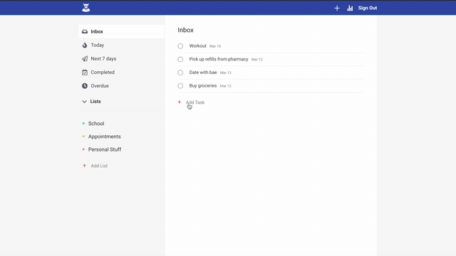

## Visit the Site 

[Boss Link](https://boss-todolist.netlify.com/)

## Description

Boss is a online todolist app. It has an user-friendly UI and all the basic features you'd expect from a todolist: schedule, organize, archive, and delete tasks.

## Built With

* React (custom hooks and context)
* Firebase (google authentication)
* [React-moment](https://www.npmjs.com/package/react-moment)
* [React-calendar](https://www.npmjs.com/package/react-calendar)
* [React-icons](https://react-icons.netlify.com/#/)

## Try For Yourself

Feel free to clone the project and modify it to your liking.

### Check if you have node and npm

```sh
node -v
npm -v
```

### Download Node.js

https://nodejs.org/en/download/

### Installing latest version of npm

```sh
npm install npm@latest -g
```

### Install dependencies

```sh
npm install
```

### Run

Inside app project directory,

```sh
npm start
```


